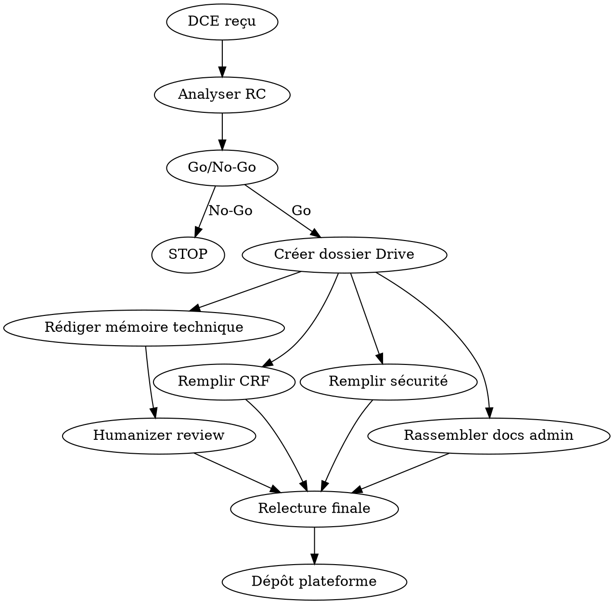

# Répondre aux Appels d'Offres (Marchés Publics FR)

## Overview

Workflow complet pour analyser un DCE, évaluer un Go/No-Go, et préparer un dossier de réponse a un appel d'offres public français. Couvre MAPA et AO ouverts.

## When to Use

- User shares a DCE or a link to e-marchespublics.com / PLACE / marches-publics.gouv.fr
- User asks to respond to an AO / marché public
- User needs a mémoire technique draft
- User wants to evaluate if a tender is worth pursuing

## Workflow



## Step 1: Analyser le DCE

Lire dans cet ordre et extraire les infos clés :

| Document | Extraire |
|----------|----------|
| **Règlement de consultation (RC)** | Date limite, critères notation (prix/technique), pondération, seuils, forme juridique |
| **CCT (Cahier des Clauses Techniques)** | Périmètre technique, stack, volumétrie, SLA/GTI/GTR |
| **CCA-AE (Clauses Admin)** | Durée marché, reconductions, pénalités, délai paiement, réversibilité |
| **Annexe sécurité** | Exigences sécu, RGPD, certifications demandées |
| **Questions/Réponses** | Infos complémentaires sur l'existant |
| **CRF** | Structure tarifaire (forfait, TJM, postes a chiffrer) |
| **Fiche de candidature** | Docs admin requis |

## Step 2: Go/No-Go

Evaluer sur 7 critères :

| Critère | Go si... |
|---------|----------|
| Périmètre technique | On maîtrise la stack |
| Taille du marché | Adapté a notre structure (PME = viser < 50K/an) |
| Pondération prix | Prix >= 40% = avantage PME |
| Type de procédure | MAPA = plus accessible, négociation possible |
| Délai de réponse | Minimum 5 jours ouvrés pour préparer |
| Concurrence probable | Peu de gros acteurs intéressés |
| Références exigées | On a des refs similaires |

## Step 3: Dossier Drive

Créer sur `gws-artguru` dans un shared drive pertinent (ex: Bakchich SAS Clients) :

```
AO [Client] [Ref] - [Objet]/
  ├── [fichiers DCE originaux]
  ├── Drafts Réponse/
  │   ├── MEMOIRE_TECHNIQUE.md → convertir en Google Doc
  │   ├── GUIDE_CRF.md → convertir en Google Doc
  │   ├── GUIDE_SECURITE.md → convertir en Google Doc
  │   └── CHECKLIST.md → convertir en Google Doc
  └── Documents Administratifs/
      ├── Kbis ou RNE (< 3 mois)
      ├── Attestation URSSAF
      ├── Attestation fiscale DGFiP
      ├── Assurance RC Pro
      ├── RIB
      └── Statuts
```

## Step 4: Mémoire Technique

Structure type (adapter selon critères du RC) :

### 1. Compréhension du besoin
- Reformuler le besoin du client (prouve qu'on a lu le DCE)
- Identifier les enjeux et contraintes

### 2. Organisation & Equipe
- Organigramme, rôles, disponibilité
- CV équipe (anonymisés si demandé)
- Gouvernance : comités, reporting, escalade

### 3. Méthodologie / Processus
- Maintenance corrective : tableau GTI/GTR par priorité
- Maintenance évolutive : cycle de vie des demandes
- Maintenance préventive : veille, mises a jour, monitoring
- Gestion du changement : préprod, rollback, communication

### 4. Moyens techniques / Hébergement
- Infrastructure proposée (hébergeur UE, specs serveur)
- Stack technique détaillée
- Sécurité : firewall, 2FA, chiffrement, journalisation
- SLA disponibilité, PCA/PRA, sauvegardes

### 5. Reprise & Réversibilité
- Plan de transition entrant (reprise de l'existant)
- Plan de transition sortant (réversibilité)
- Livrables de chaque phase

### 6. RSE
- Engagement environnemental (PUE hébergeur, sobriété numérique)
- Engagement social (égalité pro, insertion)
- Gouvernance (délais paiement, labels)

**IMPORTANT :** Toujours passer le mémoire par `/writing-humanizer` avant finalisation.

## Step 5: CRF (Cadre de Réponse Financière)

- **Prix = souvent 40-60% de la note finale** : être compétitif
- Identifier les postes multipliés (forfait x durée marché = le plus impactant)
- Fourchettes TJM PME : 350-550 EUR HT selon profil
- Ne jamais sous-estimer la reprise/réversibilité (signal de sérieux)
- Vérifier la formule de notation prix (souvent : note = prix_min / prix_candidat * pondération)

## Step 6: Questionnaire Sécurité

Si annexe sécurité avec tableau de maturité (échelle ANSSI 0-5) :

| Score | Signification |
|-------|--------------|
| 0 | Non implémenté |
| 1 | En cours, informel |
| 2 | En place, a améliorer |
| 3 | Documenté et appliqué |
| 4 | Contrôlé avec indicateurs |
| 5 | Optimisé en continu |

**Cible réaliste PME : moyenne 2-3.** Ne pas surévaluer. Un 2 avec plan d'action crédible vaut mieux qu'un 4 non justifiable.

Docs justificatifs a préparer : PSSI, charte info, politique MDP, procédure incidents, schéma archi, accord confidentialité, procédure onboarding/offboarding, politique sauvegarde.

## Step 7: Documents Administratifs

| Document | Où l'obtenir | Validité |
|----------|-------------|----------|
| Kbis / Extrait RNE | infogreffe.fr ou pappers.fr | < 3 mois |
| Attestation URSSAF | urssaf.fr > Mon compte > Mes attestations | < 6 mois |
| Attestation fiscale | impots.gouv.fr > Espace pro | < 6 mois |
| Assurance RC Pro | Demander a l'assureur | En cours de validité |
| RIB | Banque | - |
| Statuts | Archives société | Dernière version |
| Attestation sur l'honneur | Template fourni dans DCE | A signer |

## Step 8: Email de synthèse

Envoyer un récap a l'équipe avec :
- Résumé du marché (objet, montant estimé, deadline)
- Lien Drive
- Liste des [A COMPLETER] dans les drafts
- Liste des docs manquants avec instructions pour les obtenir
- Planning de préparation jour par jour

## Erreurs Fatales

- Soumission en retard (même 1 minute)
- Documents manquants dans le dossier de candidature
- Mémoire technique générique (pas adapté au DCE)
- Pas de clause réversibilité
- Confusion forfait/régie dans le chiffrage
- Prix aberrant (trop bas = éliminé, trop haut = mauvaise note)

## Meilleures cibles pour PME

- **MAPA** (procédure adaptée) : plus souple, négociation possible
- Marchés < 50K EUR/an : les grands groupes ne se battent pas pour ça
- Marchés techniques de niche : moins de concurrence
- Cotraitance (GME) avec PME complémentaires : élargit les compétences

## Sources de veille AO

- e-marchespublics.com
- marches-publics.gouv.fr (PLACE)
- boamp.fr (BOAMP)
- ted.europa.eu (marchés européens)
- Alertes par mots-clés sur ces plateformes
